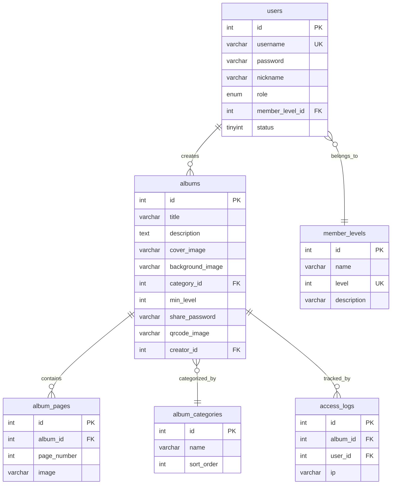

# 📖 FlipBook — 翻页画册管理系统

> **一站式电子画册创建、管理与分享平台** — 支持翻页动效、二维码分享、会员等级访问控制，全站自适应 H5 设计。

---

## 🛠 技术栈

| 层级 | 技术 |
|------|------|
| **Frontend** | HTML5 + CSS3 + Vanilla JS + Turn.js (翻页) + jQuery |
| **Backend** | PHP 8.1 + ThinkPHP 6 |
| **Database** | MySQL 8.0 (utf8mb4) |
| **QR Code** | endroid/qr-code 4.x + GD (Logo合成+文字渲染) |
| **Auth** | JWT (firebase/php-jwt) + bcrypt |
| **Infra** | Docker Compose + Nginx + PHP-FPM + Supervisor |

---

## 🚀 快速启动 (Docker)

1. 确保 Docker Desktop 已运行
2. 在根目录执行：
   ```bash
   docker compose up --build
   ```
3. 等待容器启动完成（首次构建约 2-5 分钟）
4. 访问前端：http://localhost:3000

---

## 🔗 服务地址

| 服务 | 地址 |
|------|------|
| **前端** | http://localhost:3000 |
| **后端 API** | http://localhost:8000 |
| **数据库** | localhost:3306 (user: root / pass: root) |

---

## 🧪 测试账号

| 角色 | 用户名 | 密码 | 说明 |
|------|--------|------|------|
| 管理员 | admin | 123456 | 全权限管理后台 |
| 测试用户 | testuser | 123456 | 普通会员 |
| VIP用户 | vipuser | 123456 | VIP会员，可查看所有画册 |

---

## 🏗️ 系统架构

```mermaid
graph TB
    User[用户/访客] -->|HTTP :3000| FE[Frontend<br/>Nginx + HTML/JS/CSS]
    Admin[管理员] -->|HTTP :3000| FE
    FE -->|Proxy /api/| BE[Backend<br/>ThinkPHP 6 + PHP-FPM]
    BE -->|TCP :3306| DB[(MySQL 8.0<br/>flipbook)]
    BE -->|QR Code| QR[endroid/qr-code<br/>二维码生成引擎]
    BE -->|File I/O| FS[/uploads/<br/>图片存储卷]
    FE -->|Turn.js| Flip[翻页画册渲染]
```

### 核心模块职责

| 模块 | 职责 |
|------|------|
| **用户认证** | 注册/登录/JWT Token/密码加密(bcrypt) |
| **画册管理** | CRUD/封面/背景/页面排序/发布状态 |
| **二维码引擎** | QR码生成/Logo叠加(圆角矩形+外阴影)/双行文字 |
| **访问控制** | 会员等级分级/分享密码验证 |
| **翻页渲染** | Turn.js 翻页动效/全屏/自适应 |

---

## 💾 数据设计



---

## 📷 功能介绍

### 前台功能
- **画册浏览** — 卡片式画册列表，支持分类筛选和关键词搜索
- **翻页阅读** — Turn.js 驱动的真实翻页效果，支持全屏模式
- **会员等级** — 根据用户等级开放不同画册访问权限
- **密码分享** — 通过分享密码访问受限画册
- **用户注册/登录** — 完整的用户认证系统
- **个人中心** — 修改昵称/头像/密码/联系方式

### 管理后台
- **仪表盘** — 画册/用户/浏览量统计概览
- **画册管理** — 创建/编辑/删除画册，管理页面内容
- **二维码生成** — 带Logo(圆角矩形+外阴影)+双行文字的精美二维码
- **背景图管理** — 上传和管理画册背景图片库
- **用户管理** — 用户CRUD，角色/等级/状态管理，默认管理员保护
- **会员等级管理** — 自定义会员等级体系
- **分类管理** — 画册分类的增删改查

### 响应式设计
- 全站 H5 自适应处理，支持 PC、平板、手机
- Turn.js 翻页控件根据屏幕宽度自动调整尺寸

---

## 📁 项目结构

```
label-3443/
├── README.md                    # 项目文档
├── docker-compose.yml           # Docker编排配置
├── frontend/                    # 前端项目
│   ├── Dockerfile               # 前端容器构建
│   ├── nginx.conf               # Nginx配置(反向代理+静态资源)
│   └── src/                     # 前端源码
│       ├── index.html           # SPA入口
│       ├── css/style.css        # 全局样式(响应式)
│       ├── images/              # 预置示例图片(18张)
│       └── js/                  # JavaScript模块
│           ├── api.js           # API请求层+JWT管理+错误拦截
│           ├── utils.js         # 工具函数(图片URL/HTML转义等)
│           ├── components.js    # 通用组件(上传/Toast/Modal)
│           ├── router.js        # 前端Hash路由+权限守卫
│           └── pages/           # 页面模块(13个)
├── backend/                     # 后端项目(ThinkPHP 6)
│   ├── Dockerfile               # PHP-FPM Alpine + GD/PDO扩展
│   ├── composer.json            # PHP依赖管理
│   ├── nginx.conf               # 后端Nginx配置(FastCGI)
│   ├── supervisord.conf         # 进程管理(nginx+php-fpm)
│   ├── startup.sh               # 容器启动脚本(密码初始化)
│   ├── .env                     # 环境配置
│   ├── config/                  # ThinkPHP配置
│   ├── route/app.php            # API路由定义(RESTful)
│   ├── public/index.php         # 入口文件
│   └── app/                     # 应用代码
│       ├── controller/          # 控制器(11个)
│       ├── model/               # 数据模型(6个)
│       ├── middleware/           # 中间件(Auth/Admin/CORS)
│       ├── ExceptionHandle.php  # 统一异常处理
│       └── common.php           # 公共函数(响应/JWT/上传URL)
└── mysql/
    └── init.sql                 # 数据库初始化(6表+种子数据)
```

---

## 🔧 专业工程实践

### 1. 日志系统
- 使用 ThinkPHP `Log` facade 进行结构化日志记录
- 按级别分文件存储（error/warning/info）
- 关键操作均有日志追踪（用户登录、画册CRUD、文件上传、二维码生成等）

### 2. 错误处理
- 统一异常处理器 `ExceptionHandle`，覆盖验证错误、HTTP异常、PDO异常
- 前端统一错误拦截 + 2秒消息去重 + Toast通知
- 外键约束错误转化为友好提示（如"该分类下有N个画册，无法删除"）
- 业务错误标记 `_isBusinessError` 防止重复提示

### 3. 数据校验
- 后端使用 ThinkPHP Validate 进行严格参数校验
- 邮箱/手机号格式验证（空值可提交、有值必须合法）
- 前端输入预校验，减少无效请求

### 4. 接口设计
- RESTful API 设计，统一响应格式 `{code, message, data}`
- JWT Token 认证，支持 Bearer 模式
- CORS 中间件处理跨域
- 默认管理员操作防护（前后端双重保护：角色/等级/状态不可变更）

### 5. 生产级特性清单

| 特性 | 状态 |
|------|------|
| 响应式设计 | ✅ |
| 数据持久化 (Docker Volume) | ✅ |
| 模块化架构 | ✅ |
| 统一错误处理 | ✅ |
| 结构化日志 | ✅ |
| 输入校验 | ✅ |
| 数据种子填充 | ✅ |
| 密码安全 (bcrypt) | ✅ |
| 文件上传校验 | ✅ |
| 中文字符支持 (utf8mb4) | ✅ |
| 关联数据保护 | ✅ |
| 默认管理员保护 | ✅ |

---

## 🐳 Docker 配置说明

### 镜像
- **MySQL**: `mysql:8.0`（强制 utf8mb4）
- **PHP**: `php:8.1-fpm-alpine`（含 GD/PDO 扩展）
- **Nginx**: `nginx:alpine`（前端静态资源 + 反向代理）

### 数据持久化
- `db_data`: MySQL 数据卷
- `upload_data`: 上传文件卷

### 端口映射
| 服务 | 容器端口 | 宿主机端口 |
|------|----------|------------|
| Frontend | 80 | 3000 |
| Backend | 80 | 8000 |
| MySQL | 3306 | 3306 |
